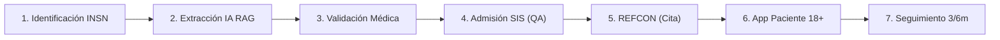

<p align="center">
  
</p>

<h1 align="center">PUENTE 18+</h1>
<h3 align="center">Sistema Integral de Transición y Continuidad Clínica Pediátrico-Adulto</h3>

<p align="center">
  <b>Desarrollado por el Equipo:</b> <code>HEALTH TECH</code><br>
  <i>Hackatón de Innovación en Salud — Instituto Nacional de Salud del Niño San Borja (INSN SB) 2026</i>
</p>

<p align="center">
  
  
  
  
  
  
</p>

---

## 🎯 1. El Problema Real
En el sistema de salud público (MINSA / SIS), **más del 40% de adolescentes con enfermedades crónicas o condiciones complejas (como Cardiopatías Congénitas Corregidas)** abandonan su tratamiento médico al cumplir los 18 años por:
1. **Pérdida de Información:** Historias clínicas pediátricas extensas que no llegan a los hospitales de adultos o que deben reconstruirse desde cero.
2. **Rechazos Burocráticos en Referencias:** Fichas REFCON rebotadas por errores menores de filiación, códigos CIE-10 inconsistentes o seguros SIS en trámite.
3. **Falta de Acompañamiento y Miedo:** El adolescente pasa de un entorno pediátrico sobreprotegido a un sistema de adultos despersonalizado sin preparación ni autonomía en su medicación.

---

## 💡 2. La Solución: PUENTE 18+
**PUENTE 18+** es una plataforma digital de extremo a extremo que conecta al **médico pediatra del INSN San Borja**, al **personal de Admisión SIS**, a la **Central Nacional de Referencias (REFCON)**, al **médico especialista de adultos** y al **propio paciente** a través de una experiencia guiada en **7 Etapas Continuas**.

### 🌟 Pilares de Valor
- **⚡ Síntesis Clínica con IA RAG Médica:** Extrae y estructura automáticamente años de consultas, ecocardiogramas, cateterismos y medicación activa en segundos.
- **🛡️ Subsanación Administrativa (QA / Admisión SIS):** Valida y corrige datos de filiación, anexos y cobertura SIS antes de emitir a la red nacional.
- **🗺️ Mapeo Multidisciplinario y Asignación de Cupos:** REFCON visualiza hospitales con cartera de servicios compatible (ej. Cardiología de Adultos / Cirugía Cardiovascular) y confirma citas en tiempo real.
- **🔏 Firma Digital DNIe (PKI MINSA):** Garantiza validez legal y médica del informe de transferencia con sellado de tiempo y código de verificación.
- **📱 App Ciudadana "Ruta 18+":** Módulo psicoeducativo, checklist diario de fármacos y cálculo de ruta en transporte público hacia el nuevo hospital.
- **📈 Seguimiento Longitudinal Post-Transferencia:** Monitoreo activo de asistencia a la primera cita y controles a **3 y 6 meses** para garantizar cero deserción.

---

## 🧭 3. Flujo Demostrativo en 7 Etapas



| Etapa | Nombre | Actor Responsable | Vista en el Sistema |
|---|---|---|---|
| **Etapa 1** | Identificación del Paciente | Médico Pediátrico INSN | `/medico` |
| **Etapa 2** | Extracción Clínica con IA RAG | Motor IA Asistido | `/medico` |
| **Etapa 3** | Validación y Firma Digital DNIe | Médico Pediátrico INSN | `/medico` |
| **Etapa 4** | Admisión SIS y Control de Calidad | Personal Admisión SIS | `/admin?tab=0` |
| **Etapa 5** | Evaluación y Confirmación de Cupo | Coordinador REFCON MINSA | `/refcon` |
| **Etapa 6** | Acompañamiento y Adherencia | Paciente Adolescente (Lucía) | `/paciente` |
| **Etapa 7** | Seguimiento Post-Transferencia | Trabajo Social / Admisión | `/admin?tab=2` |

---

## 🛠️ 4. Stack Tecnológico

- **Frontend:** React 18 + TypeScript + Vite
- **Diseño & UI:** Material-UI (MUI v5) + Lucide Icons + Animaciones Canvas-Confetti
- **Geolocalización y Mapas:** Leaflet + React-Leaflet + OpenStreetMap
- **Interoperabilidad Simulada:** HL7 FHIR (Patient, DiagnosticReport, CarePlan), Catálogo CIE-10 MINSA, SUSALUD / SIS
- **Arquitectura:** Component-Driven Architecture con React Context API para persistencia de estados de demostración.

---

## 🚀 5. Instalación y Ejecución Local

### Prerrequisitos
- **Node.js** >= 18.x
- **npm** >= 9.x

### Pasos

1. **Clonar el repositorio:**
   ```bash
   git clone https://github.com/TuUsuarioDeGitHub/hack-salud-nino-san-borja.git
   cd hack-salud-nino-san-borja
   ```

2. **Instalar dependencias:**
   ```bash
   npm install
   ```

3. **Iniciar el servidor de desarrollo:**
   ```bash
   npm run dev
   ```

4. **Abrir en el navegador:**
   Ingresa a `http://localhost:5173/` para visualizar el **Portal de Evaluación del Jurado**.

---

## 👥 6. Información del Equipo

* **Nombre del Equipo:** `HEALTH TECH`
* **Proyecto:** `PUENTE 18+`
* **Evento:** Hackatón de Salud Digital — Instituto Nacional de Salud del Niño San Borja (2026)

---

<p align="center">
  <b>Transformando la transición médica pediátrica en una oportunidad de vida autónoma y continua. 💙🏥</b>
</p>
